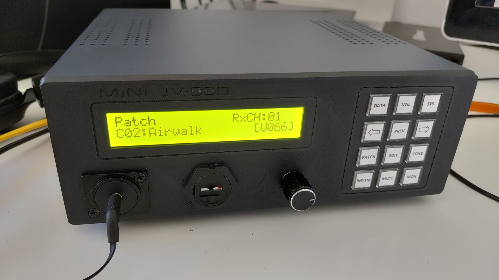

# MiniJV880-CardRAM

Mini-JV880pi is a rompler-style synthesizer closely modeled on the famous JV-880 by a well-known Japanese manufacturer running on a bare metal Raspberry Pi (without a Linux kernel or operating system).

## Related repositories

- Hardware box / STL files: https://github.com/oldmaga/MiniJV-880-Box
- Software / CardRAM public source snapshot: https://github.com/oldmaga/MiniJV880-CardRAM-public

This repository contains the MiniJV880-CardRAM software line.
The MiniJV-880-Box repository contains the hardware box/STL side of the project.

## Supported hardware and memory requirements

This MiniJV880-CardRAM line is developed and tested mainly on Raspberry Pi 4 Model B.

Recommended target:

- Raspberry Pi 4 Model B.
- A Raspberry Pi 4 model with enough RAM headroom for the number of SR-JV80 expansion images you plan to keep available.

Not recommended for this line:

- Raspberry Pi Zero class boards.
- Raspberry Pi 1 / 2 class boards.
- Raspberry Pi 3 / 3B / 3B+ class boards.
- Low-RAM configurations.

Raspberry Pi 5 is not the validation target for this line. It may require separate testing and possible build/runtime adjustments.

Important SR-JV80 memory note:

This build scans the SD-card `roms/` folder at boot and loads valid SR-JV80 expansion images into RAM. Each valid SR-JV80 expansion image uses about 8 MB of RAM. Keeping many SR images available at the same time increases boot-time memory usage.

For reliable operation, use a Raspberry Pi 4 with comfortable RAM headroom and keep only the SR-JV80 images you actually need on the SD card.

## Clean SD-card setup

MiniJV880-CardRAM releases are source-only. They do not provide a ready-made SD-card image.

A clean runtime SD card must be assembled by the user from:

- files built from this repository;
- Raspberry Pi/Circle boot files;
- legally obtained ROM/SR/PN/RD-500/CardRAM material;
- optional local configuration files.

The active MiniJV880 kernel must be copied to the FAT32 SD-card root and renamed, if necessary, to:

    kernel8-rpi4.img

Important runtime folder names such as `roms/`, `CARD-RAM/`, `PN-JV80/`, `PN-JV80/Roland-PN/` and `RD-500/` must be kept exactly as documented.

For the full SD-card layout, required runtime files, folder-depth rules, CardRAM, PN-JV80, RD-500, network and PC-side tool notes, see [Clean SD-card setup](docs/clean-sd-card-setup.md).

## Documentation

Detailed versioned documentation is kept in [docs/](docs/README.md).

Useful starting points:

- [Features and limitations](docs/features-and-limitations.md)
- [CardRAM workflow](docs/cardram-workflow.md)
- [Network maintenance](docs/network-maintenance.md)
- [Hardware and front-panel notes](docs/hardware-front-panel-notes.md)
- [Troubleshooting](docs/troubleshooting.md)

## This fork

This fork focuses on turning MiniJV880pi into a reliable standalone hardware synthesizer running on Raspberry Pi 4 in bare-metal mode.

The goal is practical MiniJV880 use with a physical front panel, SR-JV80 expansion handling, CardRAM management and local SD-card/network maintenance workflows.

Main additions and improvements in this line include:

- SR-JV80 expansion ROM overlay/menu workflow.
- DATA short press opens/closes the SR overlay.
- DATA long press enables native A/B/I/C and Card bank selection where needed.
- DATA long press Card/C selection tested in Patch Play, Performance Play, Patch Write, Performance Write, Patch Copy and Performance Copy.
- CardRAM collection management using the CARD-RAM folder and current.txt.
- CardRAM probe wrap fix during Patch Play navigation.
- PC-side CardRAM inspection/editing tools.
- Tkinter CardRAM manager GUI.
- Export/import support for raw .patchslot files.
- HTTP/TFTP local maintenance workflows for Ethernet-based management.
- PN-JV80 local SysEx folder workflow.
- RD-500 optional file workflow through the SR overlay/menu.
- Full front-panel GPIO button handling for the MiniJV880 hardware layout.
- Play Mode auto-recovery and Patch/Performance synchronization fixes.
- Serial debug output via GPIO4.
- Improved LCD handling and ghost-character fixes.
- Robust error handling for missing or invalid runtime files.

This fork aims for reliable standalone hardware operation while staying close to JV-880 behaviour where practical. Some MiniJV880 front-panel workflows are practical adaptations of the original hardware.

## Acknowledgements

This project stands on the shoulders of giants. Special thanks to:

- [giulioz](https://github.com/giulioz) for the original idea of running Mini-JV880 (Nuked-SC55) on Raspberry Pi  
- [plamikcho](https://github.com/plamikcho) for early modifications of giulioz’s code  
- [Sterr1](https://github.com/Sterr1/Mini-JV880pi) for the Mini-JV880pi project and Raspberry Pi hardware integration work  
- [nukeykt](https://github.com/nukeykt) for the [Nuked SC-55](https://github.com/nukeykt/Nuked-SC55) emulator, on which this synth is based  
- [probonopd](https://github.com/probonopd) for [MiniDexed](https://github.com/probonopd/MiniDexed), which served as the basis for this bare-metal implementation  
- [rsta2](https://github.com/rsta2) for [Circle](https://github.com/rsta2/circle), the bare-metal Raspberry Pi framework used by this project  
- [smuehlst](https://github.com/smuehlst) for [circle-stdlib](https://github.com/smuehlst/circle-stdlib), providing Standard C/C++ library support
